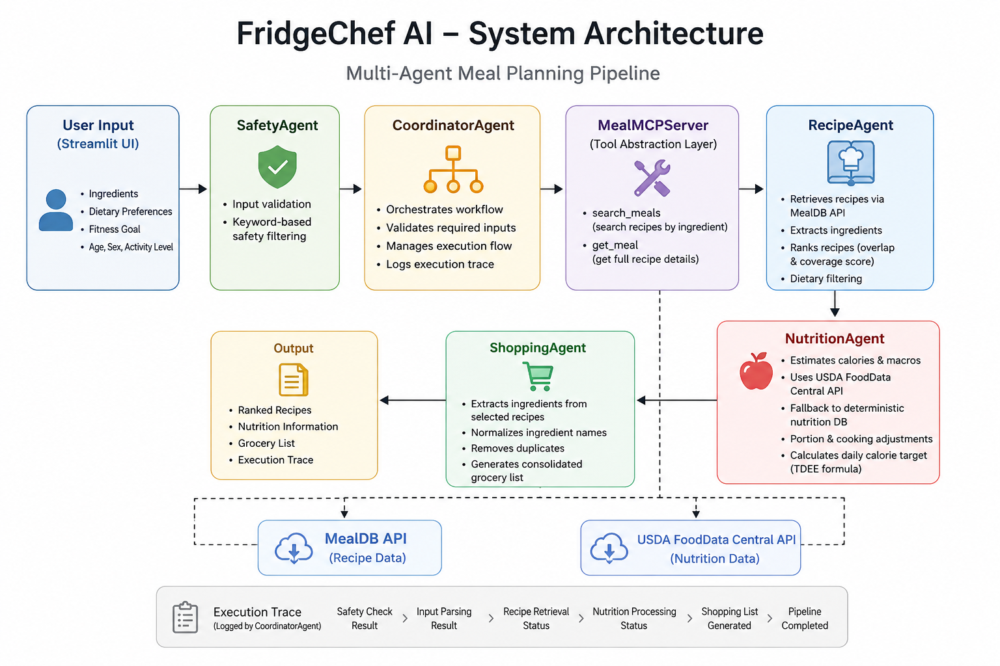

# FridgeChef AI — Multi-Agent Meal Planning System

## Overview

FridgeChef AI is a multi-agent meal planning system that demonstrates agent orchestration for meal planning workflows.

The system generates recipe suggestions, estimates nutrition, and creates grocery lists based on user-provided ingredients and dietary goals.

FridgeChef AI uses a modular pipeline where each component has a specific responsibility, making the system easier to maintain, test, and extend.

---

# Problem Statement

Meal planning can be challenging when users:

- Have limited or random ingredients available
- Want meals aligned with fitness goals such as weight loss or weight gain
- Need structured grocery lists
- Want basic nutritional information about meals

Many recipe applications focus mainly on recipe search and do not combine ingredient availability, nutrition estimation, grocery planning, and workflow orchestration into one system.

---

# Solution Overview

FridgeChef AI addresses this problem by separating meal planning into specialized components:

- Recipe retrieval and ranking
- Nutrition estimation
- Grocery list generation
- Safety filtering
- External API integration

Each responsibility is handled by a dedicated agent coordinated through a central workflow manager.

The system focuses on modular design, deterministic processing, and transparent execution rather than relying on a single large component.

---

# Why a Multi-Agent Approach?

Meal planning contains several independent tasks that require different processing logic.

Instead of implementing everything inside one component, FridgeChef AI separates responsibilities into specialized agents:

- **SafetyAgent** handles input validation and safety checks
- **RecipeAgent** retrieves and ranks recipes
- **NutritionAgent** estimates nutritional values
- **ShoppingAgent** organizes ingredients into a grocery list

The **CoordinatorAgent** manages the execution flow between these components.

This separation improves maintainability, testing, and the ability to replace or extend individual components.

---

# System Architecture

```
User Input (Streamlit UI)
↓
SafetyAgent (basic input validation)
↓
CoordinatorAgent (workflow orchestration)
↓
MealMCPServer (tool abstraction layer)
↓
RecipeAgent (recipe retrieval + ranking via MealDB API)
↓
NutritionAgent (macro estimation using USDA API + fallback rules)
↓
ShoppingAgent (ingredient consolidation)
↓
Final Output (recipes, nutrition, grocery list)
```



---

## How it works

1. User enters ingredients
2. Safety filter checks input
3. RecipeAgent fetches + ranks meals from MealDB
4. NutritionAgent estimates macros using USDA + fallback rules
5. ShoppingAgent consolidates ingredients
6. Coordinator returns structured output

---

## Example Output

Input:
chicken, rice, eggs

Output:
- 3 ranked recipes
- calorie estimate per meal
- full grocery list

---

# Project Structure

FridgeChef-AI/

├── agents/
│ ├── coordinator_agent.py
│ ├── recipe_agent.py
│ ├── nutrition_agent.py
│ ├── shopping_agent.py
│ └── safety_agent.py
│
├── docs/
│   └── architecture.png
│
├── skills/
│ └── meal_skill.py
│
├── mcp_server/
│ ├── server.py
│ └── tools.py
│
├── services/
│ └── nutrition_api.py
│
├── tests/
│ ├── test_api.py
│ ├── test_recipe_agent.py
│ ├── test_nutrition_agent.py
│ ├── test_safety.py
│ └── test_coordinator.py
│
├── app.py
├── requirements.txt
└── README.md

---

# Agent Components

## CoordinatorAgent

Responsibilities:

- Orchestrates the complete workflow
- Validates required user inputs (age, sex, activity level)
- Runs safety checks before processing
- Coordinates execution between agents
- Maintains execution traces for debugging and transparency

---

## RecipeAgent

Responsibilities:

- Retrieves recipes from MealDB API through the MealMCPServer
- Ranks recipes using rule-based ingredient overlap and coverage scoring
- Applies basic dietary filtering
- Returns ranked recipes with match explanations

---

## NutritionAgent

Responsibilities:

- Estimates recipe calories and macronutrients
- Uses USDA FoodData Central API when available
- Falls back to deterministic nutrition values when API data is unavailable
- Calculates basic calorie targets using a TDEE formula
- Applies portion and cooking adjustments

---

## ShoppingAgent

Responsibilities:

- Extracts ingredients from selected recipes
- Normalizes ingredient names
- Removes duplicate items
- Generates a structured grocery list

---

## SafetyAgent

Responsibilities:

- Performs keyword-based input safety checks
- Blocks obvious harmful or self-harm-related inputs before processing

---

# MCP Tool Layer

The MealMCPServer provides a lightweight MCP-inspired tool abstraction layer.

It acts as an intermediary between agent logic and external services, exposing structured tools that agents can call without directly handling API communication.

Available tools:

- search_meals — searches recipes by ingredient
- get_meal — retrieves complete recipe information by meal ID

This separation keeps external integrations isolated from agent logic and improves modularity and testing.

---

# Key System Features

## 1. Multi-Agent Pipeline Architecture

The system separates responsibilities into multiple agents instead of placing all functionality inside a single component.

Implemented agents:

- CoordinatorAgent
- RecipeAgent
- NutritionAgent
- ShoppingAgent
- SafetyAgent

---

## 2. Tool Abstraction Layer

External API calls are centralized through the MealMCPServer layer.

Benefits:

- Separates tool usage from business logic
- Makes integrations easier to replace
- Simplifies testing

---

## 3. Rule-Based Recipe Ranking

Recipes are ranked using deterministic scoring logic.

Ranking considers:

- Ingredient overlap
- Ingredient coverage percentage
- Dietary filtering
- Lightweight strategy-based scoring adjustments (high protein, low calorie, balanced meals)

---

## 4. Nutrition Estimation Pipeline

Nutrition values are calculated using:

- USDA FoodData Central API (when available)
- Deterministic fallback nutrition database
- Portion scaling rules
- Basic cooking adjustments

---

## 5. Safety Filtering Layer

User inputs are checked before entering the meal planning workflow.

Current protections include:

- Keyword-based safety filtering
- Blocking obvious harmful/self-harm-related phrases

---

## 6. Execution Trace Logging

The CoordinatorAgent records pipeline steps including:

- Safety results
- Parsing results
- Recipe generation status
- Nutrition processing
- Grocery list generation

This helps with debugging and understanding system execution.

---

# Course Concepts Demonstrated

## Multi-Agent Architecture

Implemented using:

- CoordinatorAgent
- RecipeAgent
- NutritionAgent
- ShoppingAgent
- SafetyAgent

---

## Tool Usage / MCP Concepts

Implemented using:

- MealMCPServer
- search_meals tool
- get_meal tool

---

## Security Features

Implemented using:

- SafetyAgent input validation
- Environment-based API key management
- Separation of external API access through the tool layer

---

## Agent Development Practices

Implemented using:

- Modular agent design
- Execution tracing
- Automated testing
- Clear separation of responsibilities

---

# Demo

The application provides:

- Ingredient-based meal recommendations
- Recipe match explanations
- Estimated nutrition information
- Grocery list generation
- Pipeline execution trace

The user interface is built using Streamlit.

---

# Security Considerations

The system includes a basic safety layer before executing the meal planning workflow.

Current protections include:

- Input validation through SafetyAgent
- Blocking obvious harmful/self-harm-related keywords
- Centralized external API access through the tool layer
- API keys stored using environment variables instead of source code

---

## Testing Strategy

The project includes unit and integration tests covering:

- MCP tool routing
- Recipe generation and ranking
- Nutrition estimation logic
- Safety filtering behavior
- Full pipeline execution

Run tests:

```bash
pytest
```

---

## Installation & Execution

## Quick Start

1. Clone the repository:

```bash
git clone https://github.com/yourusername/FridgeChef-AI.git
cd FridgeChef-AI
```

### Install dependencies

```bash
pip install -r requirements.txt
```

### Run tests

```bash
pytest
```
### Start the Streamlit app:

```bash
streamlit run app.py
```
---

# Technical Stack

- Python
- Streamlit (UI)
- Requests (API calls)
- Pytest (testing framework)
- MealDB API
- USDA FoodData Central API

---

# Installation & Execution (Environment)

Create a .env file:

USDA_API_KEY=your_api_key_here

Run:

streamlit run app.py

---

# Deployment

The current application runs as a Streamlit application.

Current deployment approach:

- Streamlit UI
- Environment-based configuration
- Local execution

Future options:

- Streamlit Community Cloud
- Docker containerization
- FastAPI backend deployment

---

# Limitations

- Nutrition estimates are simplified and not intended for medical or clinical use.
- Recipe ranking is heuristic-based and relies on deterministic scoring rules.
- Safety filtering uses keyword-based detection and is not context-aware.
- The system does not maintain persistent user memory or long-term personalization.
- External API coverage depends on available data from MealDB and USDA FoodData Central.

---

# Future Improvements

- Add LLM-based conversational recipe refinement
- Add natural language meal request parsing
- Add user preference memory
- Improve ingredient quantity extraction
- Extend MCP tool integrations

---

# Summary

FridgeChef AI demonstrates a modular multi-agent system for meal planning using deterministic logic, external APIs, and structured workflow orchestration.

Key principles:

- Modular agent architecture
- Tool abstraction layer
- Reproducible pipelines
- Transparent execution tracing
- Maintainable system design
